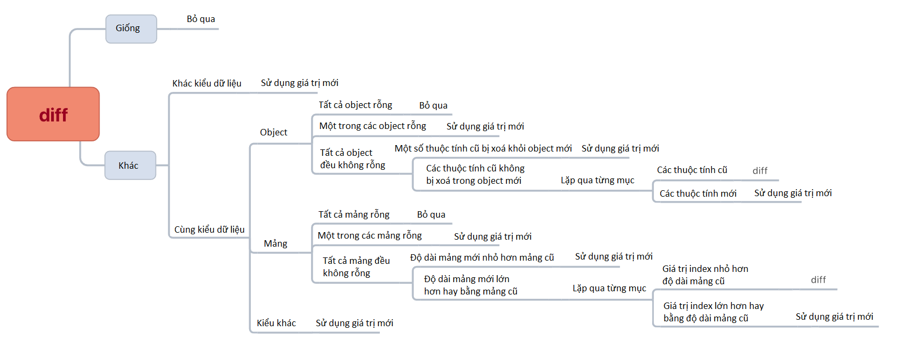

# redux-miniprogram-bindings

[Redux](https://github.com/reduxjs/redux) cho các mini-programs (Tiki, Alipay và Wechat)

## Đặc điểm

- API đơn giản và linh hoạt. Nó có thể được sử dụng dễ dàng chỉ với một connect (cung cấp phương thức tắt - shortcut method - tương tác `$page` alias và `$component` alias).
- Đầy đủ các hàm, phương thức đa dạng đáp ứng các nhu cầu và ngữ cảnh sử dụng khác nhau.
- Hỗ trợ sử dụng trong TXML.
- Sau khi `dispatch` được thực thi, trạng thái nội tại (internal state) của các component tự động được cập nhật; và view được đưa vào hàng đợi để kết xuất cập nhật.
- Hỗ trợ mini-program của Tiki, WeChat và Alipay.

## Cài đặt

- Cài đặt thông qua `npm` hay `yarn`.

  ```bash
  # npm
  $ npm install --save redux-miniprogram-bindings redux
  # yarn
  $ yarn add redux-miniprogram-bindings redux
  ```

- Ngoài ra bạn có thể tìm thấy các tập tin phân phối bên trong của thư mục dist của redux-miniprogram-bindings.

- Tập tin redux cần được import riêng biệt (nó là thư viện binding và không chứa redux code).

## Sử dụng

1. Tạo ra thực thể Redux Store

   ```js
   // store.js
   import { createStore, combineReducers } from 'redux'

   function counter(state = 0, action) {
     switch (action.type) {
       case 'INCREMENT':
         return state + (action.step || 1)
       case 'DECREMENT':
         return state - (action.step || 1)
       default:
         return state
     }
   }

   const initUserInfo = { name: 'userName', age: 25 }
   function userInfo(state = initUserInfo, action) {
     switch (action.type) {
       case 'SET_USER_INFO':
         return { ...state, ...action.userInfo }
       default:
         return state
     }
   }

   const rootReducer = combineReducers({ counter, userInfo })
   const store = createStore(rootReducer)

   export default store
   ```

2. Thiết lập provider trong tập tin `app.js`

   ```js
   // setupStore.js
   import store from 'your/store/path'
   // micro channel applet
   import { setProvider } from 'redux-miniprogram-bindings'
   //  Alipay applet 
   // import { setProvider } from 'redux-miniprogram-bindings/dist/redux-miniprogram-bindings.alipay.min.js'

   setProvider({ store })
   ```

   ```js
   // app.js
   // Make sure to call
   import './setupStore.js'

   App({
     /** ... */
   })
   ```

3. Sử dụng trong page

   ```js
   import { $page } from 'redux-miniprogram-bindings'
   import { actionCreator1, actionCreator2 } from 'your/store/action-creators/path'

   $page({
     mapState: ['dependent', 'state'],
     mapDispatch: {
       methodsName1: actionCreator1,
       methodsName2: actionCreator2,
     },
   })({
     onLoad() {
       // Read the value in state
       const { dependent } = this.data
       // dispatch actionCreator1
       this.methodsName1()
       // dispatch actionCreator2
       this.methodsName2(/** ...args */)
     },
   })
   ```

4. Sử dụng trong component

   ```js
   import { $component } from 'redux-miniprogram-bindings'
   import { actionCreator1, actionCreator2 } from 'your/store/action-creators/path'

   $component({
     mapState: [
       (state) => ({
         data1: state.dependent,
         data2: state.state,
       }),
     ],
     mapDispatch: (dispatch) => ({
       methodsName1: () => dispatch(actionCreator1()),
       methodsName2: (...args) => dispatch(actionCreator2(...args)),
     }),
   })({
     attached() {
       // Read the value in state
       const { data1: dependent } = this.data
       // dispatch actionCreator1
       this.methodsName1()
       // dispatch actionCreator2
       this.methodsName2(/** ...args */)
     },
   })
   ```

5. Sử dụng trong XML

   ```html
   <view tiki:if="{{ data1 }}">{{ data2 }}</view>
   ```

6. Để biết thêm chi tiết, tham khảo [`API`](#API) [Ví dụ](https://github.com/tikivn/redux-miniprogram-bindings/tree/master/example)

## API

### setProvider：`(config) => void`

Thiết lập Provider

- Các thuộc tính：

  - store：`Store`

    Redux Store instance object, phải được truyền.

  - namespace：`string`

    Mặc định có giá trị rỗng.

    Sau khi namespace được thiết lập, tất cả dependent state data sẽ được lưu trữ trong đối tượng với trường namespace là key value. Trong trường hợp này, giá trị state cần được đọc cùng với giá trị của trường namespace.

    > Giả sử `namespace: '$store'`， bạn cần sử dụng `this.data.$store.xxx` để nhận giá trị dependent state trong Page (hoặc Component) và bạn cần thêm tiền tố trong XML`<view>{{ $store.xxx }}</view>`

    > Ý nghĩa của namespace:
    >
    > - Xác định dữ liệu nào đến từ store.
    > - Dữ liệu trong store phải được dispatch để kích hoạt việc cập nhật. Namespace có thể giúp tránh dùng nhầm `this.setData` khiến dữ liệu trong store bị thay đổi không mong muốn nhờ có thêm tiền tố namespace：`this.setData({ '$store.xxx': xxx })`

  - component2: `boolean`

    Có mở component thứ 2 hay không，giá trị mặc định `false`. Chỉ có Alipay applet hỗ trợ.

- Hàm này phải được gọi trước tất cả các code liên quan đến `store` 

  **Best Practices：**

  Làm cách nào đảm bảo rằng `setProvider` được gọi trước tất cả mã sử dụng `store`？

  Bạn có thể tạo một tập tin .js riêng biệt (ví dụ `setupStore.js`) để gọi `setProvider`，Import tập tin này ở đầu tập tin `app.js`. 

  ```js
  // setupStore.js
  import store from 'your/store/path'
  // WeChat Mini Program
  import { setProvider } from 'redux-miniprogram-bindings'

  setProvider({ store })
  ```

  ```js
  // app.js
  import './setupStore.js'

  App({})
  ```

### connect：`(config) => (options) => void | options`

Kết nối store

- Thuộc tính：

  - type：`"page" | "component"`

    Đối tượng kết nối. Nhận giá trị：`page`、`component`; mặc định là `page`.

  - mapState：`(string | ((state: Object) => Object))[]`

    State mà instance phụ thuộc vào，tuỳ chọn

    Dependent state data sẽ được inject vào dữ liệu của store, và sẽ được tự động cập nhật khi state biến đổi sau đó. Nó có kiểu dữ liệu là mảng; mảng này có thể chứa string hoặc hàm.

    - Mảng string：Các string là các key value tương ứng của dependent state. Page hay component sẽ tự động cập nhật trạng thái và đi vào hàng đợi theo lô chờ kích hoạt kết xuất view khi dependent state thay đổi.

      ```js
      {
        // state1, state2 are the key values ​​in the state of the store
        // store.getState().state1
        // store.getState().state2
        mapState: ['state1', 'state2']
      }
      ```

    - Mảng hàm：Hàm nhận state làm tham số. Dữ liệu mới nhất của state có thể truy xuất thông qua đối tượng state. Hàm sẽ trả về một object; mỗi mục trong object đó có thể thuộc bất kỳ kiểu dữ liệu nào, thường dựa trên dữ liệu kết hợp state.

      Phương thức này thực thi hàm khi dữ liệu ở store thay đổi (không nhất thiết phải là state mà thực thể hiện tại phụ thuộc vào) và sau đó đối chiếu kết quả trả về của hàm với dữ liệu hiện có, và tiến hành kết xuất các thay đổi.

      ```js
      {
        mapState: [
          (state) => ({
            region: state.province + state.city + state.area,
            name: state.userInfo.name,
          }),
        ]
      }
      ```

    - Mảng vừa string vừa hàm: hàm sẽ được gọi mỗi khi dữ liệu trong store thay đổi. Để tối ưu hoá hiệu suất hoạt động, tốt nhất bạn sử dụng càng nhiều string cũng như càng ít hàm càng tốt đối với mảng loại này. Ngoài ra, hàm nên nhỏ gọn và thực thi nhanh chóng. 

      ```js
      {
        mapState: [
          'name',
          (state) => ({
            region: state.province + state.city + state.area,
          }),
        ]
      }
      ```

  - mapDispatch：`Object | dispatch => Object`

    Inject một hàm xử lý dispatch, tuỳ chọn. 

    - Ở dạng object：`key` là tên của hàm tuỳ biến, nó có thể được truy cập thông qua tên bên trong object, và `value` là giá trị của hàm `actionCreator`. `actionCreator` nằm trong hàm tự động gọi dispatch và được inject vào phương thức thực thể (instance method).

      ```js
      // Configuration
      mapDispatch: {
        methodsName1: actionCreator1,
        methodsName2: actionCreator2,
      }

      // Call
      this.methodsName1()
      // equivalent to
      dispatch(actionCreator1())

      // call
      this.methodsName2(a, b, c)
      // equivalent to
      dispatch(methodsName2(a, b, c))
      ```

    - Ở dạng hàm: hàm này sẽ nhận dispatch làm tham số và trả ra một object, bao gồm hàm xử lý sau khi kết thúc tùy chỉnh.

      ```js
      // Configuration
      mapDispatch: (dispatch) => ({
        methodsName1: () => dispatch(actionCreator1()),
        methodsName2: (...args) => dispatch(actionCreator2(...args)),
      })

      // Transfer
      this.methodsName1()
      this.methodsName2(a, b, c)
      ```

    > **Lưu ý:**  Những hàm bị inject thông qua thông qua `mapDispatch` cũng có thể được sử dụng như các hàm xử lý sự kiện trong XML. Nếu bạn cần truyền các tham số hàm, theo mặc định, phương thức xử lý sự kiện (event handler) sẽ truyền đối tượng sự kiện (event object) dưới dạng tham số đầu tiên của hàm.

    ```html
    <view onTap="handleAdd">Add</view>
    ```

  - manual：`boolean`

    Cho phép gọi `Page()` hay `Component()`，giá trị mặc định `false`

    Nếu mang giá trị `true`，`connect` trả về đối tượng tùy chọn đã được xử lý, bạn gọi thủ công Page() hay Component() để khai báo thực thể. Nó hữu ích cho người dùng trong việc tùy biến các mở rộng (extension).

    ```js
    const options = connect({
      manual: true,
    })({
      // ...
    })

    options.xxx = 'xxx'

    Page(options)
    ```

- Gói mở rộng：nếu bạn không thích dùng `connect` hay cách truyền tham số của nó, bạn có thể tự tạo ra gói cho riêng mình.

  Ví dụ về Page：

  ```js
  // bootstrap.js
  import { connect } from 'redux-miniprogram-bindings'

  const oldPage = Page

  Page = function (options) {
    const { mapState, mapDispatch, ...restOptions } = options

    const realOptions = connect({
      mapState,
      mapDispatch,
      // This must be set to manual, because the Page function has been rewritten.
      manual: true,
    })(restOptions)

    oldPage(realOptions)
  }
  ```

  ```js
  // app.js
  // Introduce extension
  import './bootstrap.js'

  App({})
  ```

  ```js
  // use
  Page({
    mapState: [
      // ...
    ],
    mapDispatch: {
      // ...
    },
  })
  ```

### \$page

Alias used to connect Page

```js
$page()({})
// equivalent to
connect({ type: 'page' })({})
```

### \$component

Alias used to connect Component

```js
$component()({})
// equivalent to
connect({ type: 'component' })({})
```

### Utils

#### useStore: `() => Store`

Lấy thực thể store

```js
import { useStore } from 'redux-miniprogram-bindings'
const store = useStore()

// It is equivalent to the following method, but it is not recommended to use the following method when Alipay applet subcontracting, there will be multiple store instances
import store from 'your/store/path'
```

#### useState: `() => Object`

Lấy đối tượng state hiện tại.

```js
import { useState } from 'redux-miniprogram-bindings'
const state = useState()

// It is equivalent to the following method, but it is not recommended to use the following method when Alipay applet subcontracting, there will be multiple store instances
import store from 'your/store/path'
const state = store.getState()
```

#### useDispatch: `() => Dispatch`

Lấy hàm dispatch

```js
import { useDispatch } from 'redux-miniprogram-bindings'
const dispatch = useDispatch()

// It is equivalent to the following method, but it is not recommended to use the following method when Alipay applet subcontracting, there will be multiple store instances
import store from 'your/store/path'
const dispatch = store.dispatch
```

#### useSubscribe

Đăng ký (subscription) với store.

Nhận hàm callback khi dữ liệu trong store thay đổi. Hàm này nhận 2 tham số: `currState` - trạng hiện thời - và `prevState` - trạng thái trước đó. Nó sẽ so sánh 2 trạng thái này.

Trả về một hàm có thể được gọi để huỷ đăng ký.

```js
import { useSubscribe } from 'redux-miniprogram-bindings'

$page()({
  onLoad() {
    // Enable subscription
    this.unsubscribe = useSubscribe((currState, prevState) => {
      if (currState.userInfo.name !== prevState.userInfo.name) {
        console.log('userName change')
      }
    })
  },

  onUnload() {
    // Huỷ đăng ký
    this.unsubscribe()
  },
})
```

#### useRef

Lấy tham chiếu đến dữ liệu trong đối tượng state.

Nhận hàm selector. Hàm selector này có tham số là state và có thể trả ra bất kỳ loại giá trị nào (khuyến nghị trả về assembled data sử dụng state).

Trả về đối tượng tham chiếu, có thuộc tính `value` chỉ đọc, thông qua đó giá trị mới nhất được hàm selector trả ra có thể được truy xuất.

```js
import { useRef } from 'redux-miniprogram-bindings'
const selector = (state) => state.userInfo.name
const userNameRef = useRef(selector)

setInterval(() => {
  // Regardless of whether the state data is changed, the latest value of state.userInfo.name is always obtained
  console.log(userNameRef.value)
}, 1000)
```

Một hàm khác có chức năng tương tự

```js
import { useState } from 'redux-miniprogram-bindings'
const selector = (state) => state.userInfo.name
const getUserName = () => selector(useState())

setInterval(() => {
  // Regardless of whether the state data is changed, the latest value of state.userInfo.name is always obtained
  console.log(getUserName())
}, 1000)
```

Việc sử dụng phương thức nào hoàn toàn phụ thuộc vào sở thích cá nhân.

#### useSelector

Lưu tạm (cache) kết quả của hàm selector.

Nhận state làm tham số và có thể trả ra bất cứ loại giá trị nào (khuyến nghị trả về assembled data sử dụng state).

Đồng thời, nó nhận mảng deps chứa key value của state mà sự thay đổi kết quả của hàm selector phụ thuộc vào.

Trả về một hàm có cùng signature với hàm selector. Mỗi khi hàm được thực thi, giá trị của mỗi phần trong mảng deps của dependency item sẽ được so sánh (shallow comparison) và hàm sẽ tái thực thi chỉ khi nào giá trị của dependency item thay đổi. Từ đó giảm tần suất thực thi các hàm luận lý phức tạp.

```js
// Use with useRef
import { useRef, useSelector } from 'redux-miniprogram-bindings'
// Only re-execute when state.userInfo changes
const userNameselector = useSelector((state) => state.userInfo.name, ['userInfo'])
const userNameRef = useRef(userNameselector)

setInterval(() => {
  console.log(userNameRef.value)
}, 1000)
```

```js
// Use with mapState
import { $page, useSelector } from 'redux-miniprogram-bindings'
// Only re-execute when state.userInfo changes
const userNameSelector = useSelector((state) => ({ userName: state.userInfo.name }), ['userInfo'])

$page({
  mapState: [userNameSelector],
})({})
```

## Khác biệt (diff)


